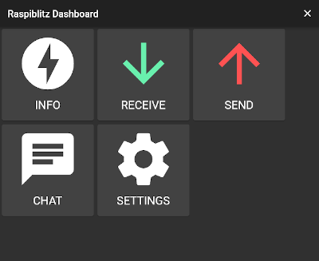
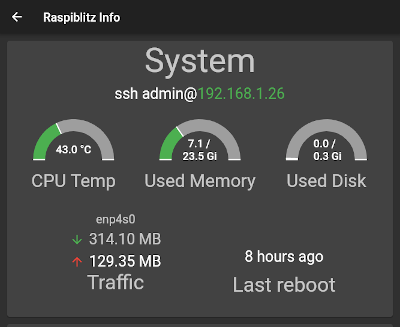
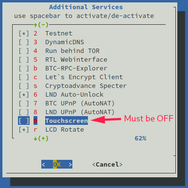
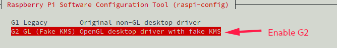
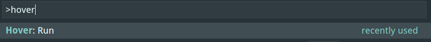
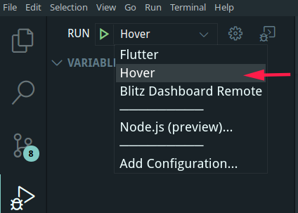
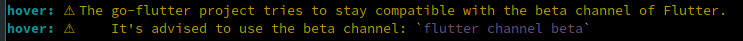
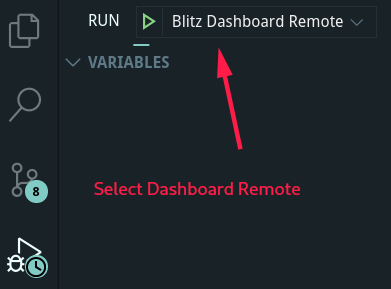
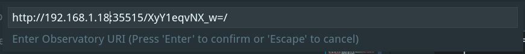

# Raspiblitz Dashboard
This app aims to be a Dashboard GUI for the [Raspiblitz](https://github.com/rootzoll/raspiblitz) project.

## Screenshots



## Contents
- [Raspiblitz Dashboard](#raspiblitz-dashboard)
  - [Screenshots](#screenshots)
  - [Contents](#contents)
  - [Setup](#setup)
    - [Hardware Requirements](#hardware-requirements)
    - [Software Requirements - Raspiblitz](#software-requirements---raspiblitz)
      - [Turn the Raspiblitz touchscreen off](#turn-the-raspiblitz-touchscreen-off)
      - [Enable the GL (Fake KMS) driver](#enable-the-gl-fake-kms-driver)
      - [Setup script to install and update all dependencies](#setup-script-to-install-and-update-all-dependencies)
      - [Enable remote debugging and hot reload on the PI](#enable-remote-debugging-and-hot-reload-on-the-pi)
    - [Software Requirements - Dev environment](#software-requirements---dev-environment)
      - [Flutter](#flutter)
      - [Hover](#hover)
      - [Recommended VSCode Extensions](#recommended-vscode-extensions)
  - [Development](#development)
    - [Clone the repository](#clone-the-repository)
    - [Create the .env file](#create-the-env-file)
    - [Local development with Hover](#local-development-with-hover)
      - [Run](#run)
      - [Attach the debugger](#attach-the-debugger)
      - [Warning about Flutter Beta channel](#warning-about-flutter-beta-channel)
    - [Remote development with flutter-desktop](#remote-development-with-flutter-desktop)
      - [Build the Flutter bundle and push to the Blitz](#build-the-flutter-bundle-and-push-to-the-blitz)
      - [Run on the Blitz](#run-on-the-blitz)
      - [Automation script](#automation-script)
      - [Attach debugger to the app running on the Blitz](#attach-debugger-to-the-app-running-on-the-blitz)
  - [FAQ](#faq)
    - [Permission denied error when running the Dashboard](#permission-denied-error-when-running-the-dashboard)
    - [No DRI devices have been found.](#no-dri-devices-have-been-found)
  - [LICENSE](#license)

This project uses the [Flutter-PI library](https://github.com/ardera/flutter-pi) to run the app on the PI 3 and 4.

## Setup
### Hardware Requirements
* Raspiblitz with a PI 4 is recommended.
* A touchscreen must be connected to the Blitz and be available via the DRI

### Software Requirements - Raspiblitz
This setup has been tested with Raspiblitz V1.6RC1.

#### Turn the Raspiblitz touchscreen off
Open the Raspiblitz services menu and turn off *9. Touchscreen*: \


#### Enable the GL (Fake KMS) driver
* Open the raspi config menu: `sudo raspi-config`
* Open 7 - Advanced options
* Open A8 - GL Driver
* Enable G2 - GL (Fake KMS) driver \
  

#### Setup script to install and update all dependencies
[A script](scripts/prepare_flutter_pi.sh) is provided to automate the setup process on the PI.

Run the script: \
`wget https://raw.githubusercontent.com/fusion44/blitz_dashboard/master/scripts/prepare_flutter_pi.sh && sudo sh prepare_flutter_pi.sh`

#### Enable remote debugging and hot reload on the PI
Flutter allows us to write code on our development machine and push changes instantly (hot reload) to the app running on the PI.

**Attention:** *This is obviously a security concern. Don't use this method on a production Blitz!*

Allow the observatory port with UFW: `sudo ufw allow 35515 comment "Flutter Observatory"`


### Software Requirements - Dev environment
#### Flutter
Install [Flutter stable](https://flutter.dev/docs/get-started/install) for the dev system.

#### Hover
To develop and test the Blitz Dashboard on the local machine we use [Hover](https://hover.build/). 
Install and make sure it works on the dev machine:
```sh
$ hover version
Hover v0.41.5
```

#### Recommended VSCode Extensions
* [Dart-Code Dart Support](https://marketplace.visualstudio.com/items?itemName=Dart-Code.dart-code)
* [Dart-Code Flutter Support](https://marketplace.visualstudio.com/items?itemName=Dart-Code.flutter)
* [dart-import](https://marketplace.visualstudio.com/items?itemName=luanpotter.dart-import) (The default import mechanism doesn't follow official style guidelines for some reason)
* [Hover](https://marketplace.visualstudio.com/items?itemName=go-flutter.hover)

## Development
### Clone the repository
`git clone git@github.com:fusion44/blitz_dashboard.git`

### Create the .env file
Currently there is no logic to auto detect the running lightning node. As a way around that, we need a .env file with the connection data. See the comments in the [.env_sample](.env_sample) file.

### Local development with Hover
#### Run
Run `hover run` in the root directory.

If the Hover VSCode extension is installed, just run the `Hover: Run` command. This will automatically attach the debugger. \


#### Attach the debugger
While the app is running use the *Hover* launch configuration. This is only necessary when the app was launched from command line. \


#### Warning about Flutter Beta channel
 \
This warning can be ignored.

### Remote development with flutter-desktop
#### Build the Flutter bundle and push to the Blitz
Run `flutter build bundle` in the root directory and copy the `build/flutter_assets` folder to the Blitz.

#### Run on the Blitz
* Without remote debugging 
  `sudo ./flutter-pi /home/admin/dev/blitz_dashboard/flutter_assets`
* With remote debugging
  
  `sudo ./flutter-pi /home/admin/dev/blitz_dashboard/flutter_assets --observatory-host=0.0.0.0 --observatory-port=35515` 
  
  The port can be adapted to any free port. UFW settings must be adapted accordingly. 


#### Automation script
A short shell script is provided to automate some of the chores. Run in the project root directory. Change paths, ips and the password accordingly.
```sh
flutter build bundle

local_dir=~/dev/raspiblitz/blitz_dashboard/build/flutter_assets
remote_url=admin@192.168.1.18:/home/admin/dev/blitz_dashboard
sshpass -p "password A here" rsync -re ssh --progress $local_dir $remote_url
```

#### Attach debugger to the app running on the Blitz
One of the last lines when running the app should read something like this: \
`flutter: Observatory listening on http://0.0.0.0:35515/gIfGp_vaQZ8=/` \
Copy the URL.

In VSCode run the `Blitz Dashboard Remote` launch configuration. \
 \
VSCode will ask for the remote URL\
 \
Replace the ip with the ip of the target machine.

## FAQ
### Permission denied error when running the Dashboard 

The Flutter-Framework uses the DRI interface and cannot run when the X is running. Make sure to turn off Touchscreen support in the Blitz services menu.

----

### No DRI devices have been found.
Run the command with sudo rights. Currently there seems to be bug that a non root user can't query the available DRI devices. 

## LICENSE
MIT - See the [LICENSE](LICENSE) file.
